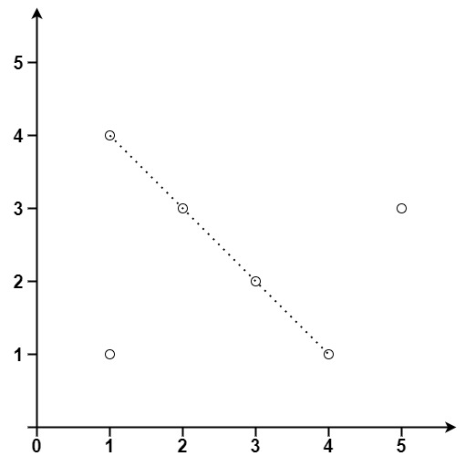

# [LeetCode][leetcode] task # 149: [Max Points on a Line][task]

Description
-----------

> Given an array of `points` where `points[i] = [xi, yi]` represents a point on the **X-Y** plane,
> return _the maximum number of points that lie on the same straight line_.

 Example
-------



```sh
Input: points = [[1,1],[3,2],[5,3],[4,1],[2,3],[1,4]]
Output: 4
```

Solution
--------

| Task | Solution                         |
|:----:|:---------------------------------|
| 149  | [Max Points on a Line][solution] |


[leetcode]: <http://leetcode.com/>
[task]: <https://leetcode.com/problems/max-points-on-a-line/>
[solution]: <https://github.com/wellaxis/praxis-leetcode/blob/main/src/main/java/com/witalis/praxis/leetcode/task/h2/p149/option/Practice.java>
