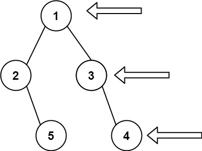

# [LeetCode][leetcode] task # 199: [Binary Tree Right Side View][task]

Description
-----------

> Given the `root` of a binary tree, imagine yourself standing on the **right side** of it,
> return _the values of the nodes you can see ordered from top to bottom_.

 Example
-------



```sh
Input: root = [1,2,3,null,5,null,4]
Output: [1,3,4]
```

Solution
--------

| Task | Solution                                |
|:----:|:----------------------------------------|
| 199  | [Binary Tree Right Side View][solution] |


[leetcode]: <http://leetcode.com/>
[task]: <https://leetcode.com/problems/binary-tree-right-side-view/>
[solution]: <https://github.com/wellaxis/praxis-leetcode/blob/main/src/main/java/com/witalis/praxis/leetcode/task/h2/p199/option/Practice.java>
