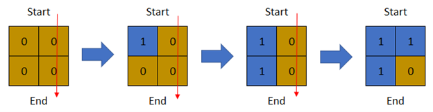

# [LeetCode][leetcode] task # 1970: [Last Day Where You Can Still Cross][task]

Description
-----------

> There is a **1-based** binary matrix where `0` represents land and `1` represents water.
> You are given integers `row` and `col` representing the number of rows and columns in the matrix, respectively.
> 
> Initially on day `0`, the entire **matrix** is **land**.
> However, each day a new cell becomes flooded with **water**.
> You are given a **1-based** 2D array `cells`, where `cells[i] = [ri, ci]` represents that on the `i^th` day,
> the cell on the `ri^th` row and `ci^th` column (**1-based** coordinates) will be covered with **water** (i.e., changed to `1`).
> 
> You want to find the **last** day that it is possible to walk from the **top** to the **bottom** by only walking on land cells.
> You can start from **any** cell in the top row and end at **any** cell in the bottom row.
> You can only travel in the four cardinal directions (left, right, up, and down).
> 
> Return _the **last** day when it is possible to walk from the **top** to the **bottom** by only walking on land cells_.

 Example
-------



```sh
Input: row = 2, col = 2, cells = [[1,1],[2,1],[1,2],[2,2]]
Output: 2
Explanation: The above image depicts how the matrix changes each day starting from day 0.
    The last day where it is possible to cross from top to bottom is on day 2.
```

Solution
--------

| Task | Solution                                       |
|:----:|:-----------------------------------------------|
| 1970 | [Last Day Where You Can Still Cross][solution] |


[leetcode]: <http://leetcode.com/>
[task]: <https://leetcode.com/problems/last-day-where-you-can-still-cross/>
[solution]: <https://github.com/wellaxis/praxis-leetcode/blob/main/src/main/java/com/witalis/praxis/leetcode/task/h20/p1970/option/Practice.java>
