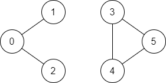

# [LeetCode][leetcode] task # 1971: [Find if Path Exists in Graph][task]

Description
-----------

> There is a **bi-directional** graph with `n` vertices, where each vertex is labeled from `0` to `n - 1` (**inclusive**).
> The edges in the graph are represented as a 2D integer array `edges`,
> where each `edges[i] = [ui, vi]` denotes a bi-directional edge between vertex `ui` and vertex `vi`.
> Every vertex pair is connected by **at most one** edge, and no vertex has an edge to itself.
> 
> You want to determine if there is a **valid path** that exists from vertex `source` to vertex `destination`.
> 
> Given `edges` and the integers `n`, `source`, and `destination`,
> return _`true` if there is a **valid path** from `source` to `destination`, or `false` otherwise_.

Example
-------



```sh
Input: n = 6, edges = [[0,1],[0,2],[3,5],[5,4],[4,3]], source = 0, destination = 5
Output: false
Explanation: There is no path from vertex 0 to vertex 5.
```

Solution
--------

| Task | Solution                                 |
|:----:|:-----------------------------------------|
| 1971 | [Find if Path Exists in Graph][solution] |


[leetcode]: <http://leetcode.com/>
[task]: <https://leetcode.com/problems/find-if-path-exists-in-graph/>
[solution]: <https://github.com/wellaxis/praxis-leetcode/blob/main/src/main/java/com/witalis/praxis/leetcode/task/h20/p1971/option/Practice.java>
