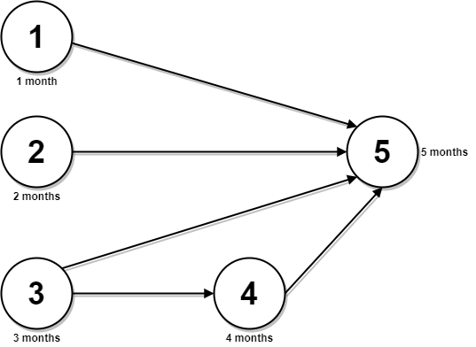

# [LeetCode][leetcode] task # 2050: [Parallel Courses III][task]

Description
-----------

> You are given an integer `n`, which indicates that there are `n` courses labeled from `1` to `n`.
> You are also given a 2D integer array `relations` where `relations[j] = [prevCourse[j], nextCourse[j]]` denotes
> that course `prevCourse[j]` has to be completed **before** course `nextCourse[j]` (prerequisite relationship).
> Furthermore, you are given a **0-indexed** integer array `time` where `time[i]` denotes
> how many **months** it takes to complete the `(i+1)th` course.
> 
> You must find the **minimum** number of months needed to complete all the courses following these rules:
> * You may start taking a course at **any time** if the prerequisites are met.
> * Any **number of courses** can be taken at the **same time**.
> 
> Return _the **minimum** number of months needed to complete all the courses_.
> 
> **Note**: The test cases are generated such that it is possible to complete every course
> (i.e., the graph is a directed acyclic graph).

 Example
-------



```sh
Input: n = 5, relations = [[1,5],[2,5],[3,5],[3,4],[4,5]], time = [1,2,3,4,5]
Output: 12
Explanation: The figure above represents the given graph and the time required to complete each course.
    You can start courses 1, 2, and 3 at month 0.
    You can complete them after 1, 2, and 3 months respectively.
    Course 4 can be taken only after course 3 is completed, i.e., after 3 months. It is completed after 3 + 4 = 7 months.
    Course 5 can be taken only after courses 1, 2, 3, and 4 have been completed, i.e., after max(1,2,3,7) = 7 months.
    Thus, the minimum time needed to complete all the courses is 7 + 5 = 12 months.
```

Solution
--------

| Task | Solution                         |
|:----:|:---------------------------------|
| 2050 | [Parallel Courses III][solution] |


[leetcode]: <http://leetcode.com/>
[task]: <https://leetcode.com/problems/parallel-courses-iii/>
[solution]: <https://github.com/wellaxis/praxis-leetcode/blob/main/src/main/java/com/witalis/praxis/leetcode/task/h21/p2050/option/Practice.java>
