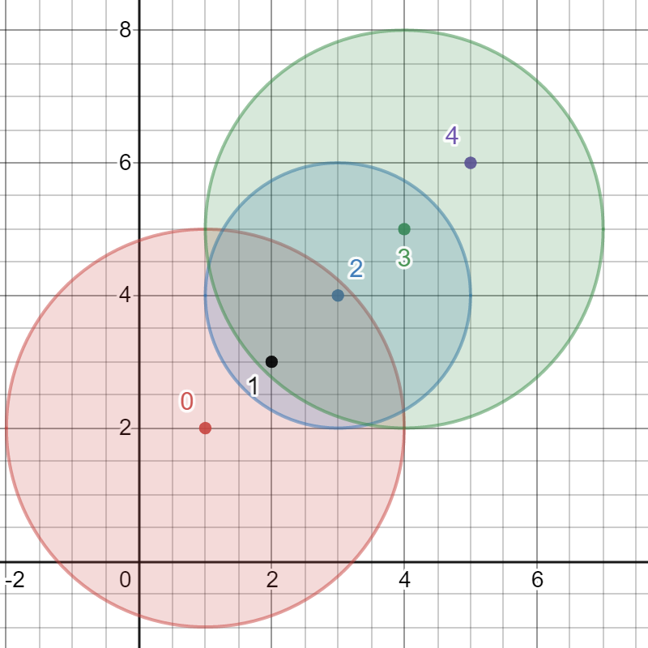

# [LeetCode][leetcode] task # 2101: [Detonate the Maximum Bombs][task]

Description
-----------

> You are given a list of bombs. The **range** of a bomb is defined as the area where its effect can be felt.
> This area is in the shape of a **circle** with the center as the location of the bomb.
> 
> The bombs are represented by a **0-indexed** 2D integer array `bombs` where `bombs[i] = [xi, yi, ri]`.
> `xi` and `yi` denote the X-coordinate and Y-coordinate of the location of the `i^th` bomb,
> whereas `ri` denotes the **radius** of its range.
> 
> You may choose to detonate a **single** bomb.
> When a bomb is detonated, it will detonate **all bombs** that lie in its range.
> These bombs will further detonate the bombs that lie in their ranges.
> 
> Given the list of `bombs`, return _the **maximum** number of bombs that can be detonated
> if you are allowed to detonate **only one** bomb.

Example
-------



```sh
Input: bombs = [[1,2,3],[2,3,1],[3,4,2],[4,5,3],[5,6,4]]
Output: 5
Explanation:
The best bomb to detonate is bomb 0 because:
    - Bomb 0 detonates bombs 1 and 2. The red circle denotes the range of bomb 0.
    - Bomb 2 detonates bomb 3. The blue circle denotes the range of bomb 2.
    - Bomb 3 detonates bomb 4. The green circle denotes the range of bomb 3.
Thus all 5 bombs are detonated.
```

Solution
--------

| Task | Solution                               |
|:----:|:---------------------------------------|
| 2101 | [Detonate the Maximum Bombs][solution] |


[leetcode]: <http://leetcode.com/>
[task]: <https://leetcode.com/problems/detonate-the-maximum-bombs/>
[solution]: <https://github.com/wellaxis/praxis-leetcode/blob/main/src/main/java/com/witalis/praxis/leetcode/task/h22/p2101/option/Practice.java>
