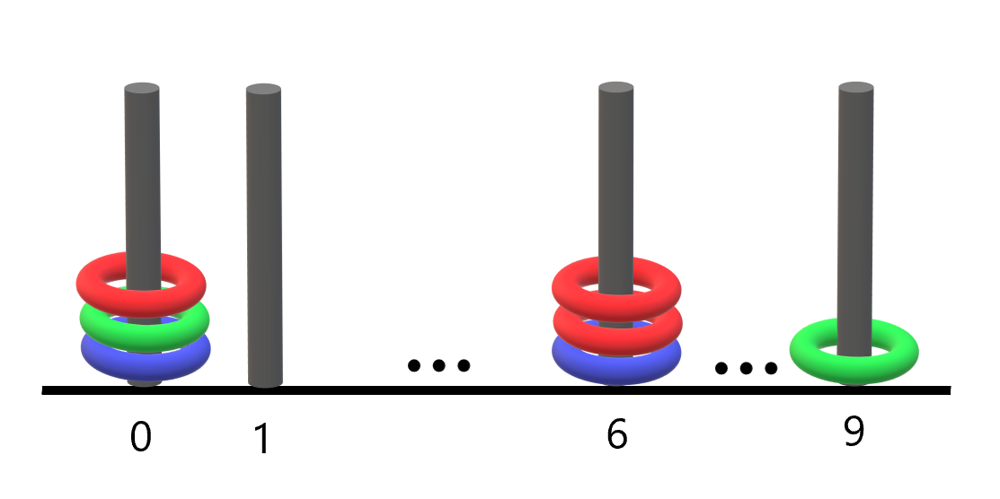

# [LeetCode][leetcode] task # 2103: [Rings and Rods][task]

Description
-----------

> There are `n` rings and each ring is either red, green, or blue.
> The rings are distributed **across ten rods** labeled from `0` to `9`.
> 
> You are given a string `rings` of length `2n` that describes the `n` rings
> that are placed onto the rods. Every two characters in `rings` forms
> a **color-position pair** that is used to describe each ring where:
> * The **first** character of the `i^th` pair denotes the `i^th` ring's **color** (`'R'`, `'G'`, `'B'`).
> * The **second** character of the `i^th` pair denotes the **rod** that the `i^th` ring is placed on (`'0'` to `'9'`).
>
> For example, `"R3G2B1"` describes `n == 3` rings:
> a red ring placed onto the rod labeled 3,
> a green ring placed onto the rod labeled 2,
> and a blue ring placed onto the rod labeled 1.
> 
> Return _the number of rods that have **all three colors** of rings on them_.

Example
-------



```sh
Input: rings = "B0B6G0R6R0R6G9"
Output: 1
Explanation: 
- The rod labeled 0 holds 3 rings with all colors: red, green, and blue.
- The rod labeled 6 holds 3 rings, but it only has red and blue.
- The rod labeled 9 holds only a green ring.
Thus, the number of rods with all three colors is 1.
```

Solution
--------

| Task | Solution                   |
|:----:|:---------------------------|
| 2103 | [Rings and Rods][solution] |


[leetcode]: <http://leetcode.com/>
[task]: <https://leetcode.com/problems/rings-and-rods/>
[solution]: <https://github.com/wellaxis/praxis-leetcode/blob/main/src/main/java/com/witalis/praxis/leetcode/task/h22/p2103/option/Practice.java>
