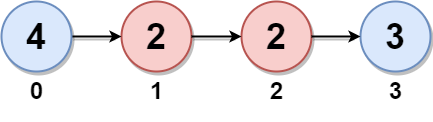

# [LeetCode][leetcode] task # 2130: [Maximum Twin Sum of a Linked List][task]

Description
-----------

> In a linked list of size `n`, where `n` is **even**, the `i^th` node (**0-indexed**) of the linked list
> is known as the **twin** of the `(n-1-i)^th` node, if `0 <= i <= (n / 2) - 1`.
> 
> * For example, if `n = 4`, then node `0` is the twin of node `3`, and node `1` is the twin of node `2`.
> These are the only nodes with twins for `n = 4`.
>
> The **twin sum** is defined as the sum of a node and its twin.
> 
> Given the `head` of a linked list with even length, return _the **maximum twin sum** of the linked list_.



Example
-------

```sh
Input: head = [4,2,2,3]
Output: 7
Explanation:
    The nodes with twins present in this linked list are:
    - Node 0 is the twin of node 3 having a twin sum of 4 + 3 = 7.
    - Node 1 is the twin of node 2 having a twin sum of 2 + 2 = 4.
    Thus, the maximum twin sum of the linked list is max(7, 4) = 7.
```

Solution
--------

| Task | Solution                                      |
|:----:|:----------------------------------------------|
| 2130 | [Maximum Twin Sum of a Linked List][solution] |


[leetcode]: <http://leetcode.com/>
[task]: <https://leetcode.com/problems/maximum-twin-sum-of-a-linked-list/>
[solution]: <https://github.com/wellaxis/praxis-leetcode/blob/main/src/main/java/com/witalis/praxis/leetcode/task/h22/p2130/option/Practice.java>
