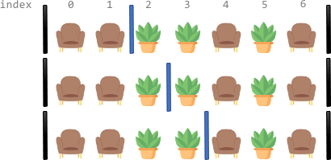

# [LeetCode][leetcode] task # 2147: [Number of Ways to Divide a Long Corridor][task]

Description
-----------

> Along a long library corridor, there is a line of seats and decorative plants.
> You are given a **0-indexed** string corridor of length `n` consisting of letters `'S'` and `'P'`
> where each `'S'` represents a seat and each `'P'` represents a plant.
> 
> One room divider has **already** been installed to the left of index `0`, and another to the right of index `n - 1`.
> Additional room dividers can be installed.
> For each position between indices `i - 1` and `i` (`1 <= i <= n - 1`), at most one divider can be installed.
> 
> Divide the corridor into non-overlapping sections, where each section has **exactly two seats** with any number of plants.
> There may be multiple ways to perform the division. Two ways are **different** if there is a position
> with a room divider installed in the first way but not in the second way.
> 
> Return _the number of ways to divide the corridor_.
> Since the answer may be very large, return it **modulo** `10^9 + 7`. If there is no way, return `0`.

Example
-------



```sh
Input: corridor = "SSPPSPS"
Output: 3
Explanation: There are 3 different ways to divide the corridor.
    The black bars in the above image indicate the two room dividers already installed.
    Note that in each of the ways, each section has exactly two seats.
```

Solution
--------

| Task | Solution                                             |
|:----:|:-----------------------------------------------------|
| 2147 | [Number of Ways to Divide a Long Corridor][solution] |


[leetcode]: <http://leetcode.com/>
[task]: <https://leetcode.com/problems/number-of-ways-to-divide-a-long-corridor/>
[solution]: <https://github.com/wellaxis/praxis-leetcode/blob/main/src/main/java/com/witalis/praxis/leetcode/task/h22/p2147/option/Practice.java>
