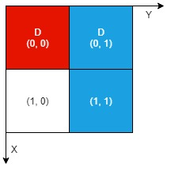

# [LeetCode][leetcode] task # 2201: [Count Artifacts That Can Be Extracted][task]

Description
-----------

> There is an `n x n` **0-indexed** grid with some artifacts buried in it.
> You are given the integer `n` and a **0-indexed** 2D integer array `artifacts`
> describing the positions of the rectangular artifacts where
> `artifacts[i] = [r1i, c1i, r2i, c2i]` denotes that the `i^th` artifact is buried in the subgrid where:
> * `(r1i, c1i)` is the coordinate of the top-left cell of the `i^th` artifact and
> * `(r2i, c2i)` is the coordinate of the bottom-right cell of the `i^th` artifact.
>
> You will excavate some cells of the grid and remove all the mud from them.
> If the cell has a part of an artifact buried underneath, it will be uncovered.
> If all the parts of an artifact are uncovered, you can extract it.
> 
> Given a **0-indexed** 2D integer array `dig` where `dig[i] = [ri, ci]` indicates
> that you will excavate the cell `(ri, ci)`, return _the number of artifacts that you can extract_.
> 
> The test cases are generated such that:
> * No two artifacts overlap.
> * Each artifact only covers at most 4 cells.
> * The entries of dig are unique.

 Example
-------



```sh
Input: n = 2, artifacts = [[0,0,0,0],[0,1,1,1]], dig = [[0,0],[0,1]]
Output: 1
Explanation: 
The different colors represent different artifacts. Excavated cells are labeled with a 'D' in the grid.
There is 1 artifact that can be extracted, namely the red artifact.
The blue artifact has one part in cell (1,1) which remains uncovered, so we cannot extract it.
Thus, we return 1.
```

Solution
--------

| Task | Solution                                          |
|:----:|:--------------------------------------------------|
| 2201 | [Count Artifacts That Can Be Extracted][solution] |


[leetcode]: <http://leetcode.com/>
[task]: <https://leetcode.com/problems/count-artifacts-that-can-be-extracted/>
[solution]: <https://github.com/wellaxis/praxis-leetcode/blob/main/src/main/java/com/witalis/praxis/leetcode/task/h23/p2201/option/Practice.java>
