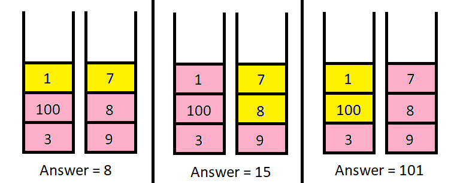

# [LeetCode][leetcode] task # 2218: [Maximum Value of K Coins From Piles][task]

Description
-----------

> There are `n` **piles** of coins on a table. Each pile consists of a **positive number** of coins of assorted denominations.
> 
> In one move, you can choose any coin on **top** of any pile, remove it, and add it to your wallet.
> 
> Given a list `piles`, where `piles[i]` is a list of integers denoting the composition
> of the `i^th` pile from **top to bottom**, and a positive integer `k`,
> return _the **maximum total value** of coins you can have in your wallet if you choose **exactly** `k` coins optimally_.

Example
-------




```sh
Input: piles = [[1,100,3],[7,8,9]], k = 2
Output: 101
Explanation:
    The above diagram shows the different ways we can choose k coins.
    The maximum total we can obtain is 101.
```

Solution
--------

| Task | Solution                                        |
|:----:|:------------------------------------------------|
| 2218 | [Maximum Value of K Coins From Piles][solution] |


[leetcode]: <http://leetcode.com/>
[task]: <https://leetcode.com/problems/maximum-value-of-k-coins-from-piles/>
[solution]: <https://github.com/wellaxis/praxis-leetcode/blob/main/src/main/java/com/witalis/praxis/leetcode/task/h23/p2218/option/Practice.java>
