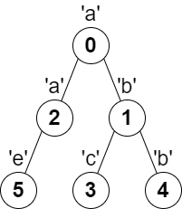

# [LeetCode][leetcode] task # 2246: [Longest Path With Different Adjacent Characters][task]

Description
-----------

> You are given a **tree** (i.e. a connected, undirected graph that has no cycles)
> **rooted** at node `0` consisting of `n` nodes numbered from `0` to `n - 1`.
> The tree is represented by a **0-indexed** array `parent` of size `n`,
> where `parent[i]` is the parent of node `i`. Since node `0` is the root, `parent[0] == -1`.
> 
> You are also given a string `s` of length `n`, where `s[i]` is the character assigned to node `i`.
> 
> Return _the length of the **longest path** in the tree such that
> no pair of **adjacent** nodes on the path have the same character assigned to them_.

Example
-------



```sh
Input: parent = [-1,0,0,1,1,2], s = "abacbe"
Output: 3
Explanation: The longest path where each two adjacent nodes have different characters in the tree is the path: 0 -> 1 -> 3.
    The length of this path is 3, so 3 is returned.
    It can be proven that there is no longer path that satisfies the conditions.
```

Solution
--------

| Task | Solution                                                    |
|:----:|:------------------------------------------------------------|
| 2246 | [Longest Path With Different Adjacent Characters][solution] |


[leetcode]: <http://leetcode.com/>
[task]: <https://leetcode.com/problems/longest-path-with-different-adjacent-characters/>
[solution]: <https://github.com/wellaxis/praxis-leetcode/blob/main/src/main/java/com/witalis/praxis/leetcode/task/h23/p2246/option/Practice.java>
