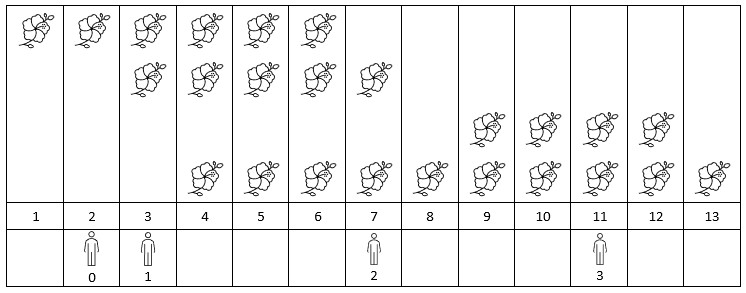

# [LeetCode][leetcode] task # 2251: [Number of Flowers in Full Bloom][task]

Description
-----------

> You are given a **0-indexed** 2D integer array `flowers`, where `flowers[i] = [start[i], end[i]]` means
> the `i^th` flower will be in **full bloom** from `start[i]` to `end[i]` (**inclusive**).
> You are also given a **0-indexed** integer array `people` of size `n`,
> where `people[i]` is the time that the `i^th` person will arrive to see the flowers.
> 
> Return _an integer array `answer` of size `n`, where `answer[i]` is
> the **number** of flowers that are in full bloom when the `i^th` person arrives_.

 Example
-------



```sh
Input: flowers = [[1,6],[3,7],[9,12],[4,13]], people = [2,3,7,11]
Output: [1,2,2,2]
Explanation: The figure above shows the times when the flowers are in full bloom and when the people arrive.
    For each person, we return the number of flowers in full bloom during their arrival.
```

Solution
--------

| Task | Solution                                    |
|:----:|:--------------------------------------------|
| 2251 | [Number of Flowers in Full Bloom][solution] |


[leetcode]: <http://leetcode.com/>
[task]: <https://leetcode.com/problems/number-of-flowers-in-full-bloom/>
[solution]: <https://github.com/wellaxis/praxis-leetcode/blob/main/src/main/java/com/witalis/praxis/leetcode/task/h23/p2251/option/Practice.java>
