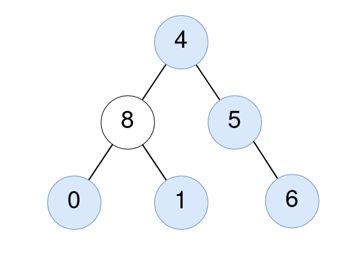

# [LeetCode][leetcode] task # 2265: [Count Nodes Equal to Average of Subtree][task]

Description
-----------

> Given the `root` of a binary tree, return _the number of nodes where
> the value of the node is equal to the **average** of the values in its **subtree**_.
> 
> **Note:**
> * The **average** of `n` elements is the **sum** of the `n` elements divided by `n` and **rounded down** to the nearest integer.
> * A **subtree** of `root` is a tree consisting of `root` and all of its descendants.

 Example
-------



```sh
Input: root = [4,8,5,0,1,null,6]
Output: 5
Explanation: 
    For the node with value 4: The average of its subtree is (4 + 8 + 5 + 0 + 1 + 6) / 6 = 24 / 6 = 4.
    For the node with value 5: The average of its subtree is (5 + 6) / 2 = 11 / 2 = 5.
    For the node with value 0: The average of its subtree is 0 / 1 = 0.
    For the node with value 1: The average of its subtree is 1 / 1 = 1.
    For the node with value 6: The average of its subtree is 6 / 1 = 6.
```

Solution
--------

| Task | Solution                                            |
|:----:|:----------------------------------------------------|
| 2265 | [Count Nodes Equal to Average of Subtree][solution] |


[leetcode]: <http://leetcode.com/>
[task]: <https://leetcode.com/problems/count-nodes-equal-to-average-of-subtree/>
[solution]: <https://github.com/wellaxis/praxis-leetcode/blob/main/src/main/java/com/witalis/praxis/leetcode/task/h23/p2265/option/Practice.java>
