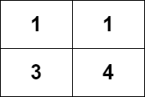

# [LeetCode][leetcode] task # 2328: [Number of Increasing Paths in a Grid][task]

Description
-----------

> You are given an `m x n` integer matrix `grid`, where you can move from a cell to any adjacent cell in all `4` directions.
> 
> Return _the number of **strictly increasing** paths in the grid such that you can start from **any** cell and end at **any** cell_.
> Since the answer may be very large, return it **modulo** `10^9 + 7`.
> 
> Two paths are considered different if they do not have exactly the same sequence of visited cells.

 Example
-------



```sh
Input: grid = [[1,1],[3,4]]
Output: 8
Explanation: The strictly increasing paths are:
- Paths with length 1: [1], [1], [3], [4].
- Paths with length 2: [1 -> 3], [1 -> 4], [3 -> 4].
- Paths with length 3: [1 -> 3 -> 4].
The total number of paths is 4 + 3 + 1 = 8.
```

Solution
--------

| Task | Solution                                         |
|:----:|:-------------------------------------------------|
| 2328 | [Number of Increasing Paths in a Grid][solution] |


[leetcode]: <http://leetcode.com/>
[task]: <https://leetcode.com/problems/number-of-increasing-paths-in-a-grid/>
[solution]: <https://github.com/wellaxis/praxis-leetcode/blob/main/src/main/java/com/witalis/praxis/leetcode/task/h24/p2328/option/Practice.java>
