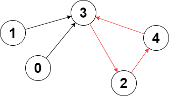

# [LeetCode][leetcode] task # 2360: [Longest Cycle in a Graph][task]

Description
-----------

> You are given a **directed** graph of `n` nodes numbered from `0` to `n - 1`,
> where each node has **at most one** outgoing edge.
> 
> The graph is represented with a given **0-indexed** array edges of size `n`,
> indicating that there is a directed edge from node `i` to node `edges[i]`.
> If there is no outgoing edge from node `i`, then `edges[i] == -1`.
> 
> Return _the length of the **longest** cycle in the graph_. If no cycle exists, return `-1`.
> 
> A cycle is a path that starts and ends at the **same** node.

 Example
-------



```sh
Input: edges = [3,3,4,2,3]
Output: 3
Explanation: The longest cycle in the graph is the cycle: 2 -> 4 -> 3 -> 2.
    The length of this cycle is 3, so 3 is returned.
```

Solution
--------

| Task | Solution                             |
|:----:|:-------------------------------------|
| 2360 | [Longest Cycle in a Graph][solution] |


[leetcode]: <http://leetcode.com/>
[task]: <https://leetcode.com/problems/longest-cycle-in-a-graph/>
[solution]: <https://github.com/wellaxis/praxis-leetcode/blob/main/src/main/java/com/witalis/praxis/leetcode/task/h24/p2360/option/Practice.java>
