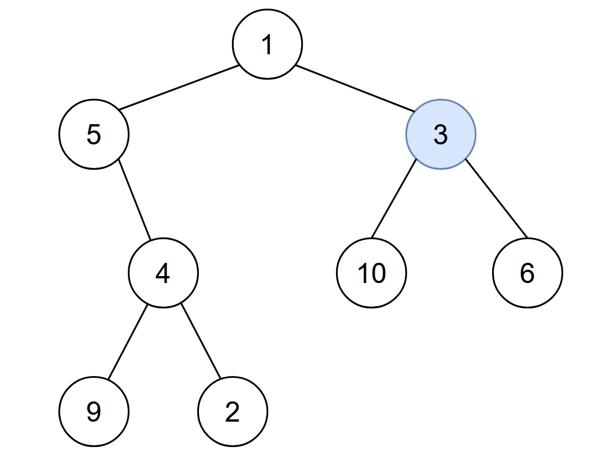

# [LeetCode][leetcode] task # 2385: [Amount of Time for Binary Tree to Be Infected][task]

Description
-----------

> You are given the `root` of a binary tree with **unique** values, and an integer `start`.
> At minute `0`, an **infection** starts from the node with value `start`.
> 
> Each minute, a node becomes infected if:
> * The node is currently uninfected.
> * The node is adjacent to an infected node.
>
> Return _the number of minutes needed for the entire tree to be infected_.

 Example
-------



```sh
Input: root = [1,5,3,null,4,10,6,9,2], start = 3
Output: 4
Explanation: The following nodes are infected during:
    - Minute 0: Node 3
    - Minute 1: Nodes 1, 10 and 6
    - Minute 2: Node 5
    - Minute 3: Node 4
    - Minute 4: Nodes 9 and 2
It takes 4 minutes for the whole tree to be infected so we return 4.
```

Solution
--------

| Task | Solution                                                  |
|:----:|:----------------------------------------------------------|
| 2385 | [Amount of Time for Binary Tree to Be Infected][solution] |


[leetcode]: <http://leetcode.com/>
[task]: <https://leetcode.com/problems/amount-of-time-for-binary-tree-to-be-infected/>
[solution]: <https://github.com/wellaxis/praxis-leetcode/blob/main/src/main/java/com/witalis/praxis/leetcode/task/h24/p2385/option/Practice.java>
