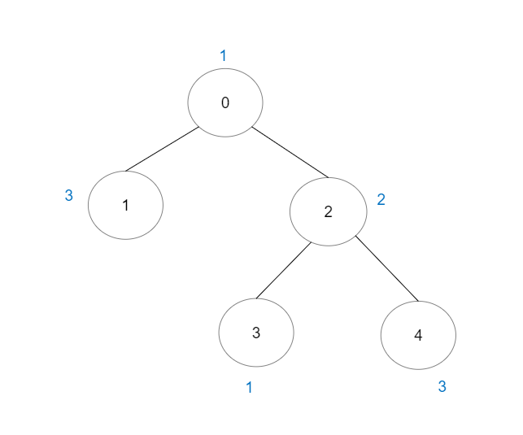

# [LeetCode][leetcode] task # 2421: [Number of Good Paths][task]

Description
-----------

> There is a tree (i.e. a connected, undirected graph with no cycles)
> consisting of `n` nodes numbered from `0` to `n - 1` and exactly `n - 1` edges.
> 
> You are given a **0-indexed** integer array `vals` of length `n`
> where `vals[i]` denotes the value of the `i^th` node.
> You are also given a 2D integer array `edges` where `edges[i] = [ai, bi]` denotes
> that there exists an **undirected** edge connecting nodes `ai` and `bi`.
> 
> A **good path** is a simple path that satisfies the following conditions:
> * The starting node and the ending node have the **same** value.
> * All nodes between the starting node and the ending node have values **less than or equal to** the starting node
> (i.e. the starting node's value should be the maximum value along the path).
> 
> Return _the number of distinct good paths_.
> 
> Note that a path and its reverse are counted as the **same** path.
> For example, `0 -> 1` is considered to be the same as `1 -> 0`.
> A single node is also considered as a valid path.

Example
-------



```sh
Input: vals = [1,3,2,1,3], edges = [[0,1],[0,2],[2,3],[2,4]]
Output: 6
Explanation: There are 5 good paths consisting of a single node.
    There is 1 additional good path: 1 -> 0 -> 2 -> 4.
    (The reverse path 4 -> 2 -> 0 -> 1 is treated as the same as 1 -> 0 -> 2 -> 4.)
    Note that 0 -> 2 -> 3 is not a good path because vals[2] > vals[0].
```

Solution
--------

| Task | Solution                         |
|:----:|:---------------------------------|
| 2421 | [Number of Good Paths][solution] |


[leetcode]: <http://leetcode.com/>
[task]: <https://leetcode.com/problems/number-of-good-paths/>
[solution]: <https://github.com/wellaxis/praxis-leetcode/blob/main/src/main/java/com/witalis/praxis/leetcode/task/h25/p2421/option/Practice.java>
