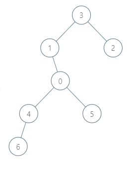

# [LeetCode][leetcode] task # 2477: [Minimum Fuel Cost to Report to the Capital][task]

Description
-----------

> There is a tree (i.e., a connected, undirected graph with no cycles) structure country network
> consisting of `n` cities numbered from `0` to `n - 1` and exactly `n - 1` roads. The capital city is city `0`.
> You are given a 2D integer array `roads` where `roads[i] = [ai, bi]` denotes that
> there exists a **bidirectional road** connecting cities `ai` and `bi`.
> 
> There is a meeting for the representatives of each city. The meeting is in the capital city.
> 
> There is a car in each city. You are given an integer `seats` that indicates the number of seats in each car.
> 
> A representative can use the car in their city to travel or change the car and ride with another representative.
> The cost of traveling between two cities is one liter of fuel.
> 
> Return _the minimum number of liters of fuel to reach the capital city_.

 Example
-------



```sh
Input: roads = [[3,1],[3,2],[1,0],[0,4],[0,5],[4,6]], seats = 2
Output: 7
Explanation: 
    - Representative2 goes directly to city 3 with 1 liter of fuel.
    - Representative2 and representative3 go together to city 1 with 1 liter of fuel.
    - Representative2 and representative3 go together to the capital with 1 liter of fuel.
    - Representative1 goes directly to the capital with 1 liter of fuel.
    - Representative5 goes directly to the capital with 1 liter of fuel.
    - Representative6 goes directly to city 4 with 1 liter of fuel.
    - Representative4 and representative6 go together to the capital with 1 liter of fuel.
    It costs 7 liters of fuel at minimum. 
    It can be proven that 7 is the minimum number of liters of fuel needed.
```

Solution
--------

| Task | Solution                                               |
|:----:|:-------------------------------------------------------|
| 2477 | [Minimum Fuel Cost to Report to the Capital][solution] |


[leetcode]: <http://leetcode.com/>
[task]: <https://leetcode.com/problems/minimum-fuel-cost-to-report-to-the-capital/>
[solution]: <https://github.com/wellaxis/praxis-leetcode/blob/main/src/main/java/com/witalis/praxis/leetcode/task/h25/p2477/option/Practice.java>
