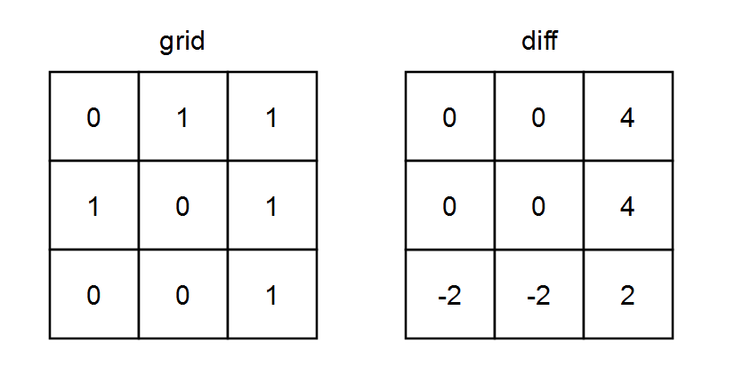

# [LeetCode][leetcode] task # 2482: [Difference Between Ones and Zeros in Row and Column][task]

Description
-----------

> You are given a **0-indexed** `m x n` binary matrix `grid`.
> 
> A **0-indexed** `m x n` difference matrix `diff` is created with the following procedure:
> * Let the number of ones in the `i^th` row be `onesRow[i]`.
> * Let the number of ones in the `j^th` column be `onesCol[j]`.
> * Let the number of zeros in the `i^th` row be `zerosRow[i]`.
> * Let the number of zeros in the `j^th` column be `zerosCol[j]`.
> * `diff[i][j] = onesRow[i] + onesCol[j] - zerosRow[i] - zerosCol[j]`
>
> Return _the difference matrix `diff`_.

 Example
-------




```sh
Input: grid = [[0,1,1],[1,0,1],[0,0,1]]
Output: [[0,0,4],[0,0,4],[-2,-2,2]]
Explanation:
    - diff[0][0] = onesRow0 + onesCol0 - zerosRow0 - zerosCol0 = 2 + 1 - 1 - 2 = 0 
    - diff[0][1] = onesRow0 + onesCol1 - zerosRow0 - zerosCol1 = 2 + 1 - 1 - 2 = 0 
    - diff[0][2] = onesRow0 + onesCol2 - zerosRow0 - zerosCol2 = 2 + 3 - 1 - 0 = 4 
    - diff[1][0] = onesRow1 + onesCol0 - zerosRow1 - zerosCol0 = 2 + 1 - 1 - 2 = 0 
    - diff[1][1] = onesRow1 + onesCol1 - zerosRow1 - zerosCol1 = 2 + 1 - 1 - 2 = 0 
    - diff[1][2] = onesRow1 + onesCol2 - zerosRow1 - zerosCol2 = 2 + 3 - 1 - 0 = 4 
    - diff[2][0] = onesRow2 + onesCol0 - zerosRow2 - zerosCol0 = 1 + 1 - 2 - 2 = -2
    - diff[2][1] = onesRow2 + onesCol1 - zerosRow2 - zerosCol1 = 1 + 1 - 2 - 2 = -2
    - diff[2][2] = onesRow2 + onesCol2 - zerosRow2 - zerosCol2 = 1 + 3 - 2 - 0 = 2
```

Solution
--------

| Task | Solution                                                        |
|:----:|:----------------------------------------------------------------|
| 2482 | [Difference Between Ones and Zeros in Row and Column][solution] |


[leetcode]: <http://leetcode.com/>
[task]: <https://leetcode.com/problems/difference-between-ones-and-zeros-in-row-and-column/>
[solution]: <https://github.com/wellaxis/praxis-leetcode/blob/main/src/main/java/com/witalis/praxis/leetcode/task/h25/p2482/option/Practice.java>
