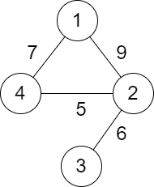

# [LeetCode][leetcode] task # 2492: [Minimum Score of a Path Between Two Cities][task]

Description
-----------

> You are given a positive integer `n` representing `n` cities numbered from `1` to `n`.
> You are also given a 2D array `roads` where `roads[i] = [a[i], b[i], distance[i]]` indicates
> that there is a **bidirectional** road between cities `a[i]` and `b[i]` with a distance equal to `distance[i]`.
> The cities graph is not necessarily connected.
> 
> The **score** of a path between two cities is defined as the **minimum** distance of a road in this path.
> 
> Return _the **minimum** possible score of a path between cities `1` and `n`_.
> 
> **Note**:
> * A path is a sequence of roads between two cities.
> * It is allowed for a path to contain the same road **multiple** times, and you can visit cities `1` and `n` multiple times along the path.
> * The test cases are generated such that there is **at least** one path between `1` and `n`.

 Example
-------



```sh
Input: n = 4, roads = [[1,2,9],[2,3,6],[2,4,5],[1,4,7]]
Output: 5
    Explanation: The path from city 1 to 4 with the minimum score is: 1 -> 2 -> 4. The score of this path is min(9,5) = 5.
    It can be shown that no other path has less score.
```

Solution
--------

| Task | Solution                                               |
|:----:|:-------------------------------------------------------|
| 2492 | [Minimum Score of a Path Between Two Cities][solution] |


[leetcode]: <http://leetcode.com/>
[task]: <https://leetcode.com/problems/minimum-score-of-a-path-between-two-cities/>
[solution]: <https://github.com/wellaxis/praxis-leetcode/blob/main/src/main/java/com/witalis/praxis/leetcode/task/h25/p2492/option/Practice.java>
