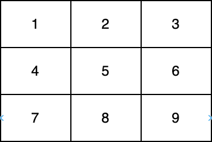

# [LeetCode][leetcode] task # 2614: [Prime In Diagonal][task]

Description
-----------

> You are given a 0-indexed two-dimensional integer array `nums`.
> 
> Return _the largest **prime** number that lies on at least one of the **diagonals** of `nums`.
> In case, no prime is present on any of the diagonals, return 0.
> 
> Note that:
> * An integer is **prime** if it is greater than `1` and has no positive integer divisors other than `1` and itself.
> * An integer `val` is on one of the **diagonals** of `nums`
> if there exists an integer `i` for which `nums[i][i] = val` or an `i` for which `nums[i][nums.length - i - 1] = val`.
>
> 
>
> In the above diagram, one diagonal is **[1,5,9]** and another diagonal is **[3,5,7]**.

 Example
-------

```sh
Input: nums = [[1,2,3],[5,6,7],[9,10,11]]
Output: 11
Explanation: The numbers 1, 3, 6, 9, and 11 are the only numbers present on at least one of the diagonals. Since 11 is the largest prime, we return 11.
```

Solution
--------

| Task | Solution                      |
|:----:|:------------------------------|
| 2614 | [Prime In Diagonal][solution] |


[leetcode]: <http://leetcode.com/>
[task]: <https://leetcode.com/problems/prime-in-diagonal/>
[solution]: <https://github.com/wellaxis/praxis-leetcode/blob/main/src/main/java/com/witalis/praxis/leetcode/task/h27/p2614/option/Practice.java>
