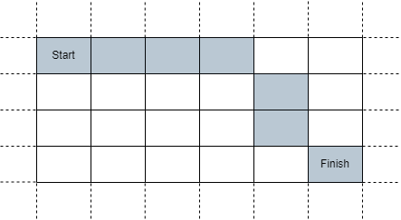

# [LeetCode][leetcode] task # 2849: [Determine if a Cell Is Reachable at a Given Time][task]

Description
-----------

> You are given four integers `sx`, `sy`, `fx`, `fy`, and a **non-negative** integer `t`.
> 
> In an infinite 2D grid, you start at the cell `(sx, sy)`. Each second, you **must** move to any of its adjacent cells.
> 
> Return _`true` if you can reach cell `(fx, fy)` after **exactly** `t` **seconds**, or `false` otherwise_.
> 
> A cell's **adjacent cells** are the 8 cells around it that share at least one corner with it.
> You can visit the same cell several times.

 Example
-------



```sh
Input: sx = 2, sy = 4, fx = 7, fy = 7, t = 6
Output: true
Explanation: Starting at cell (2, 4), we can reach cell (7, 7) in exactly 6 seconds by going through the cells depicted in the picture above. 
```

Solution
--------

| Task | Solution                                                     |
|:----:|:-------------------------------------------------------------|
| 2849 | [Determine if a Cell Is Reachable at a Given Time][solution] |


[leetcode]: <http://leetcode.com/>
[task]: <https://leetcode.com/problems/determine-if-a-cell-is-reachable-at-a-given-time/>
[solution]: <https://github.com/wellaxis/praxis-leetcode/blob/main/src/main/java/com/witalis/praxis/leetcode/task/h29/p2849/option/Practice.java>
