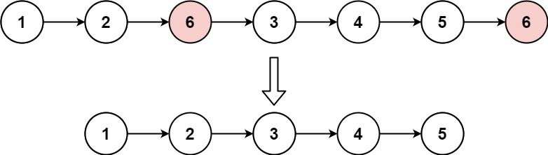

# [LeetCode][leetcode] task # 203: [Remove Linked List Elements][task]

Description
-----------

> Given the `head` of a linked list and an integer `val`,
> remove all the nodes of the linked list that has `Node.val == val`,
> and return _the new head_.



Example
-------

```sh
Input: head = [1,2,6,3,4,5,6], val = 6
Output: [1,2,3,4,5]
```

Solution
--------

| Task | Solution                                |
|:----:|:----------------------------------------|
| 203  | [Remove Linked List Elements][solution] |


[leetcode]: <http://leetcode.com/>
[task]: <https://leetcode.com/problems/remove-linked-list-elements/>
[solution]: <https://github.com/wellaxis/witalis-jkit/blob/main/module/tasks/src/main/java/com/witalis/jkit/tasks/core/task/leetcode/h3/p203/option/Practice.java>
