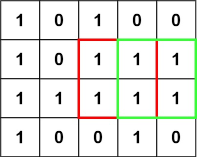

# [LeetCode][leetcode] task # 221: [Maximal Square][task]

Description
-----------

> Given an `m x n` binary `matrix` filled with `0`'s and `1`'s,
> _find the largest square containing only `1`'s and return its area_.
 
 Example
-------



```sh
Input: matrix = [["1","0","1","0","0"],["1","0","1","1","1"],["1","1","1","1","1"],["1","0","0","1","0"]]
Output: 4
```

Solution
--------

| Task | Solution                   |
|:----:|:---------------------------|
| 221  | [Maximal Square][solution] |


[leetcode]: <http://leetcode.com/>
[task]: <https://leetcode.com/problems/base-7/>
[solution]: <https://github.com/wellaxis/witalis-jkit/blob/main/module/tasks/src/main/java/com/witalis/jkit/tasks/core/task/leetcode/h3/p221/option/Practice.java>
