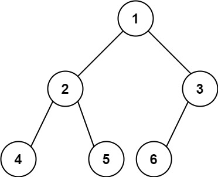

# [LeetCode][leetcode] task # 222: [Count Complete Tree Nodes][task]

Description
-----------

> Given the `root` of a **complete** binary tree, return _the number of the nodes in the tree_.
> 
> According to **Wikipedia**, every level, except possibly the last, is completely filled
> in a complete binary tree, and all nodes in the last level are as far left as possible.
> It can have between `1` and `2^h` nodes inclusive at the last level `h`.
> 
> Design an algorithm that runs in less than `O(n)` time complexity.

 Example
-------



```sh
Input: root = [1,2,3,4,5,6]
Output: 6
```

Solution
--------

| Task | Solution                              |
|:----:|:--------------------------------------|
| 222  | [Count Complete Tree Nodes][solution] |


[leetcode]: <http://leetcode.com/>
[task]: <https://leetcode.com/problems/count-complete-tree-nodes/>
[solution]: <https://github.com/wellaxis/witalis-jkit/blob/main/module/tasks/src/main/java/com/witalis/jkit/tasks/core/task/leetcode/h3/p222/option/Practice.java>
