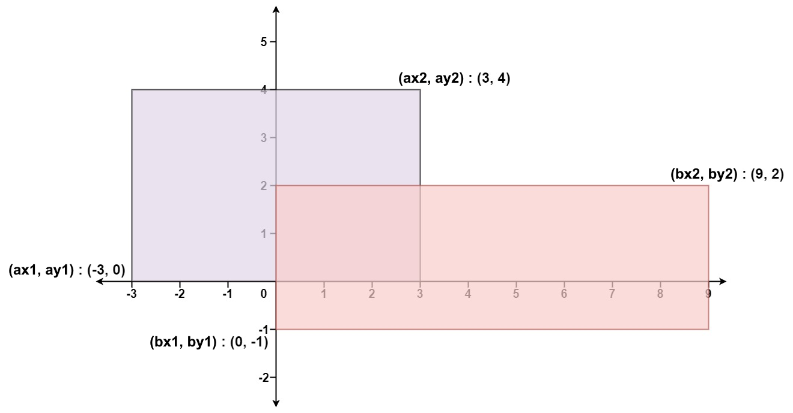

# [LeetCode][leetcode] task # 223: [Rectangle Area][task]

Description
-----------

> Given the coordinates of two **rectilinear** rectangles in a 2D plane,
> return _the total area covered by the two rectangles_.
> 
> The first rectangle is defined by its **bottom-left** corner `(ax1, ay1)` and its **top-right** corner `(ax2, ay2)`.
> 
> The second rectangle is defined by its **bottom-left** corner `(bx1, by1)` and its **top-right** corner `(bx2, by2)`.
 
 Example
-------



```sh
Input: ax1 = -3, ay1 = 0, ax2 = 3, ay2 = 4, bx1 = 0, by1 = -1, bx2 = 9, by2 = 2
Output: 45
```

Solution
--------

| Task | Solution                   |
|:----:|:---------------------------|
| 223  | [Rectangle Area][solution] |


[leetcode]: <http://leetcode.com/>
[task]: <https://leetcode.com/problems/rectangle-area/>
[solution]: <https://github.com/wellaxis/witalis-jkit/blob/main/module/tasks/src/main/java/com/witalis/jkit/tasks/core/task/leetcode/h3/p223/option/Practice.java>
