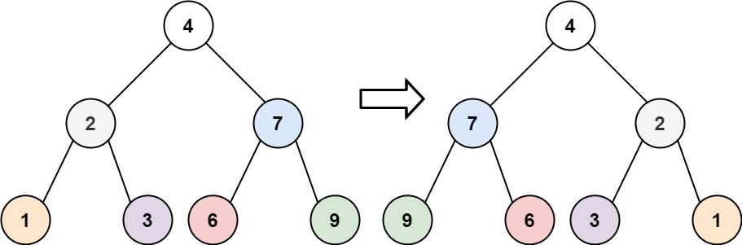

# [LeetCode][leetcode] task # 226: [Invert Binary Tree][task]

Description
-----------

> Given the `root` of a binary tree, invert the tree, and return `its root`.

 Example
-------



```sh
Input: root = [4,2,7,1,3,6,9]
Output: [4,7,2,9,6,3,1]
```

Solution
--------

| Task | Solution                       |
|:----:|:-------------------------------|
| 226  | [Invert Binary Tree][solution] |


[leetcode]: <http://leetcode.com/>
[task]: <https://leetcode.com/problems/invert-binary-tree/>
[solution]: <https://github.com/wellaxis/witalis-jkit/blob/main/module/tasks/src/main/java/com/witalis/jkit/tasks/core/task/leetcode/h3/p226/option/Practice.java>
