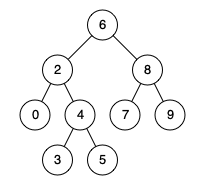

# [LeetCode][leetcode] task # 235: [Lowest Common Ancestor of a Binary Search Tree][task]

Description
-----------

> Given a binary search tree (BST), find the lowest common ancestor (LCA)
> of two given nodes in the BST.
> 
> According to the `definition of LCA on Wikipedia`:
> “The lowest common ancestor is defined between two nodes `p` and `q`
> as the lowest node in `T` that has both `p` and `q` as descendants
> (where we allow **a node to be a descendant of itself**).”

 Example
-------



```sh
Input: root = [6,2,8,0,4,7,9,null,null,3,5], p = 2, q = 8
Output: 6
Explanation: The LCA of nodes 2 and 8 is 6.
```

Solution
--------

| Task | Solution                                                   |
|:----:|:-----------------------------------------------------------|
| 235  | [Lowest Common Ancestor of a Binary Search Tree][solution] |


[leetcode]: <http://leetcode.com/>
[task]: <https://leetcode.com/problems/lowest-common-ancestor-of-a-binary-search-tree/>
[solution]: <https://github.com/wellaxis/witalis-jkit/blob/main/module/tasks/src/main/java/com/witalis/jkit/tasks/core/task/leetcode/h3/p235/option/Practice.java>
