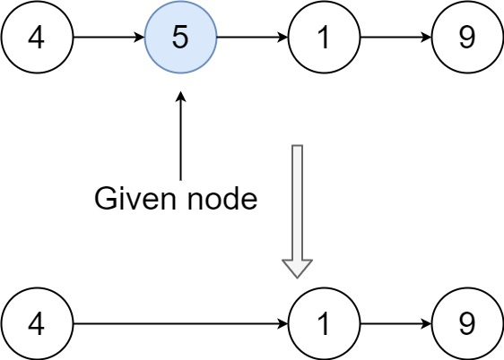

# [LeetCode][leetcode] task # 237: [Delete Node in a Linked List][task]

Description
-----------

> Write a function to **delete a node** in a singly-linked list.
> You will **not** be given access to the `head` of the list,
> instead you will be given access to **the node to be deleted** directly.
> 
> It is **guaranteed** that the node to be deleted is **not a tail node** in the list.

Example
-------



```sh
Input: head = [4,5,1,9], node = 5
Output: [4,1,9]
Explanation: You are given the second node with value 5,
    the linked list should become 4 -> 1 -> 9 after calling your function.
```

Solution
--------

| Task | Solution                                 |
|:----:|:-----------------------------------------|
| 237  | [Delete Node in a Linked List][solution] |


[leetcode]: <http://leetcode.com/>
[task]: <https://leetcode.com/problems/delete-node-in-a-linked-list/>
[solution]: <https://github.com/wellaxis/praxis-leetcode/blob/main/src/main/java/com/witalis/praxis/leetcode/task/h3/p237/option/Practice.java>
