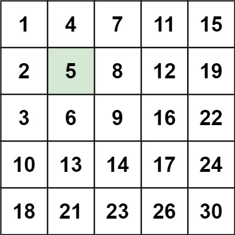

# [LeetCode][leetcode] task # 240: [Search a 2D Matrix II][task]

Description
-----------

> Write an efficient algorithm that searches for a value `target`
> in an `m x n` integer matrix `matrix`.
> This matrix has the following properties:
> * Integers in each row are sorted in ascending from left to right.
> * Integers in each column are sorted in ascending from top to bottom.

Example
-------



```sh
Input: matrix = [[1,4,7,11,15],[2,5,8,12,19],[3,6,9,16,22],[10,13,14,17,24],[18,21,23,26,30]], target = 5
Output: true
```

Solution
--------

| Task | Solution                          |
|:----:|:----------------------------------|
| 240  | [Search a 2D Matrix II][solution] |


[leetcode]: <http://leetcode.com/>
[task]: <https://leetcode.com/problems/search-a-2d-matrix-ii/>
[solution]: <https://github.com/wellaxis/witalis-jkit/blob/main/module/tasks/src/main/java/com/witalis/jkit/tasks/core/task/leetcode/h3/p240/option/Practice.java>
