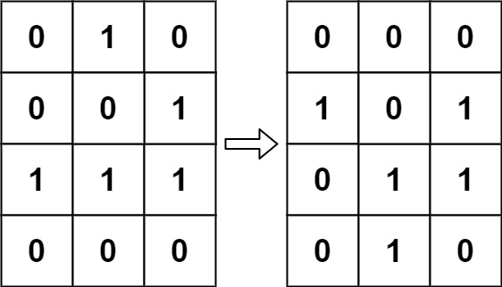

# [LeetCode][leetcode] task # 289: [Game of Life][task]

Description
-----------

> According to `Wikipedia's article`: "The **Game of Life**, also known simply as **Life**,
> is a cellular automaton devised by the British mathematician John Horton Conway in 1970."
> 
> The board is made up of an `m x n` grid of cells, where each cell has an initial state:
> **live** (represented by a `1`) or **dead** (represented by a `0`).
> Each cell interacts with its **eight neighbors** (horizontal, vertical, diagonal)
> using the following four rules (taken from the above Wikipedia article):
> * Any live cell with fewer than two live neighbors dies as if caused by under-population.
> * Any live cell with two or three live neighbors lives on to the next generation.
> * Any live cell with more than three live neighbors dies, as if by over-population.
> * Any dead cell with exactly three live neighbors becomes a live cell, as if by reproduction.
>
> The next state is created by applying the above rules simultaneously to every cell in the current state,
> where births and deaths occur simultaneously.
> Given the current state of the `m x n` grid board, return _the next state_.

Example
-------



```sh
Input: board = [[0,1,0],[0,0,1],[1,1,1],[0,0,0]]
Output: [[0,0,0],[1,0,1],[0,1,1],[0,1,0]]
```

Solution
--------

| Task | Solution                 |
|:----:|:-------------------------|
| 289  | [Game of Life][solution] |


[leetcode]: <http://leetcode.com/>
[task]: <https://leetcode.com/problems/game-of-life/>
[solution]: <https://github.com/wellaxis/witalis-jkit/blob/main/module/tasks/src/main/java/com/witalis/jkit/tasks/core/task/leetcode/h3/p289/option/Practice.java>
