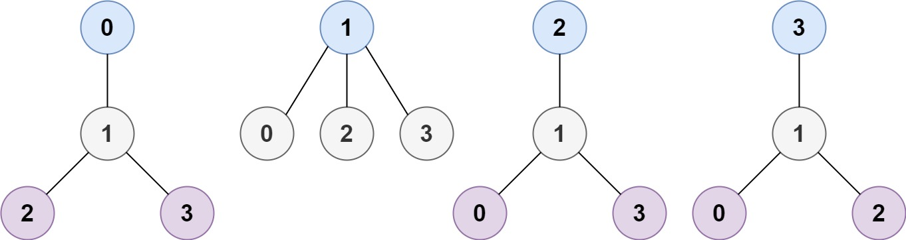

# [LeetCode][leetcode] task # 310: [Minimum Height Trees][task]

Description
-----------

> A tree is an undirected graph in which any two vertices are connected by _exactly_ one path.
> In other words, any connected graph without simple cycles is a tree.
> 
> Given a tree of `n` nodes labelled from `0` to `n - 1`,
> and an array of `n - 1` `edges` where `edges[i] = [ai, bi]` indicates that
> there is an undirected edge between the two nodes `ai` and `bi` in the tree,
> you can choose any node of the tree as the root.
> When you select a node `x` as the root, the result tree has height `h`.
> Among all possible rooted trees, those with minimum height (i.e. `min(h)`)
> are called **minimum height trees** (MHTs).
> 
> Return _a list of all **MHTs**' root labels_. You can return the answer in **any order**.
> 
> The **height** of a rooted tree is the number of edges on the longest downward path between the root and a leaf.

Example
-------



```sh
Input: n = 4, edges = [[1,0],[1,2],[1,3]]
Output: [1]
Explanation: As shown, the height of the tree is 1 when the root is the node with label 1 which is the only MHT.
```

Solution
--------

| Task | Solution                         |
|:----:|:---------------------------------|
| 310  | [Minimum Height Trees][solution] |


[leetcode]: <http://leetcode.com/>
[task]: <https://leetcode.com/problems/minimum-height-trees/>
[solution]: <https://github.com/wellaxis/witalis-jkit/blob/main/module/tasks/src/main/java/com/witalis/jkit/tasks/core/task/leetcode/h4/p310/option/Practice.java>
