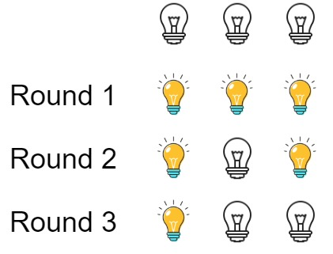

# [LeetCode][leetcode] task # 319: [Bulb Switcher][task]

Description
-----------

> There are `n` bulbs that are initially off.
> 
> You first turn on all the bulbs, then you turn off every second bulb.
> On the third round, you toggle every third bulb (turning on if it's off or turning off if it's on).
> For the `i^th` round, you toggle every `i` bulb. For the `n^th` round, you only toggle the last bulb.
> 
> Return _the number of bulbs that are on after `n` rounds_.

Example
-------



```sh
Input: n = 3
Output: 1
Explanation:
    At first, the three bulbs are [off, off, off].
    After the first round, the three bulbs are [on, on, on].
    After the second round, the three bulbs are [on, off, on].
    After the third round, the three bulbs are [on, off, off]. 
    So you should return 1 because there is only one bulb is on.
```

Solution
--------

| Task | Solution                  |
|:----:|:--------------------------|
| 319  | [Bulb Switcher][solution] |


[leetcode]: <http://leetcode.com/>
[task]: <https://leetcode.com/problems/bulb-switcher/>
[solution]: <https://github.com/wellaxis/praxis-leetcode/blob/main/src/main/java/com/witalis/praxis/leetcode/task/h4/p319/option/Practice.java>
