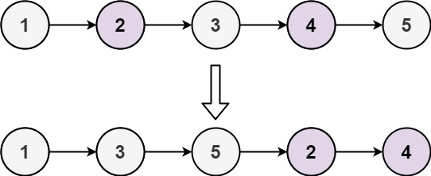

# [LeetCode][leetcode] task # 328: [Odd Even Linked List][task]

Description
-----------

> Given the `head` of a singly linked list, group all the nodes with odd indices together
> followed by the nodes with even indices, and return _the reordered list_.
> 
> The **first** node is considered odd, and the second node is even, and so on.
> 
> Note that the relative order inside both the even and odd groups should remain as it was in the input.
> 
> You must solve the problem in `O(1)` extra space complexity and `O(n)` time complexity.



Example
-------

```sh
Input: head = [1,2,3,4,5]
Output: [1,3,5,2,4]
```

Solution
--------

| Task | Solution                         |
|:----:|:---------------------------------|
| 328  | [Odd Even Linked List][solution] |


[leetcode]: <http://leetcode.com/>
[task]: <https://leetcode.com/problems/remove-linked-list-elements/>
[solution]: <https://github.com/wellaxis/praxis-leetcode/blob/main/src/main/java/com/witalis/praxis/leetcode/task/h4/p328/option/Practice.java>
