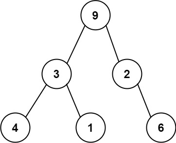

# [LeetCode][leetcode] task # 331: [Verify Preorder Serialization of a Binary Tree][task]

Description
-----------

> One way to serialize a binary tree is to use **preorder traversal**.
> When we encounter a non-null node, we record the node's value.
> If it is a null node, we record using a sentinel value such as `'#'`.
> 
> For example, the above binary tree can be serialized to the string `"9,3,4,#,#,1,#,#,2,#,6,#,#"`,
> where `'#'` represents a null node.
> 
> Given a string of comma-separated values `preorder`,
> return _`true` if it is a correct preorder traversal serialization of a binary tree_.
> 
> It is **guaranteed** that each comma-separated value in the string
> must be either an integer or a character `'#'` representing null pointer.
> 
> You may assume that the input format is always valid.
> * For example, it could never contain two consecutive commas, such as `"1,,3"`.
>
> **Note**: You are not allowed to reconstruct the tree.

Example
-------



```sh
Input: preorder = "9,3,4,#,#,1,#,#,2,#,6,#,#"
Output: true
```

Solution
--------

| Task | Solution                                                   |
|:----:|:-----------------------------------------------------------|
| 331  | [Verify Preorder Serialization of a Binary Tree][solution] |


[leetcode]: <http://leetcode.com/>
[task]: <https://leetcode.com/problems/verify-preorder-serialization-of-a-binary-tree/>
[solution]: <https://github.com/wellaxis/praxis-leetcode/blob/main/src/main/java/com/witalis/praxis/leetcode/task/h4/p331/option/Practice.java>
