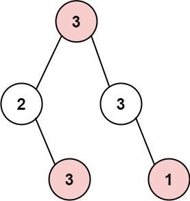

# [LeetCode][leetcode] task # 337: [House Robber III][task]

Description
-----------

> The thief has found himself a new place for his thievery again.
> There is only one entrance to this area, called `root`.
> 
> Besides the `root`, each house has one and only one parent house.
> After a tour, the smart thief realized that all houses in this place form a binary tree.
> It will automatically contact the police if **two directly-linked houses were broken into on the same night**.
> 
> Given the `root` of the binary tree,
> return _the maximum amount of money the thief can rob **without alerting the police**_.

Example
-------



```sh
Input: root = [3,2,3,null,3,null,1]
Output: 7
Explanation: Maximum amount of money the thief can rob = 3 + 3 + 1 = 7.
```

Solution
--------

| Task | Solution                     |
|:----:|:-----------------------------|
| 337  | [House Robber III][solution] |


[leetcode]: <http://leetcode.com/>
[task]: <https://leetcode.com/problems/house-robber-iii/>
[solution]: <https://github.com/wellaxis/praxis-leetcode/blob/main/src/main/java/com/witalis/praxis/leetcode/task/h4/p337/option/Practice.java>
