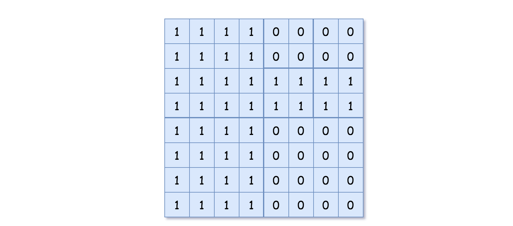
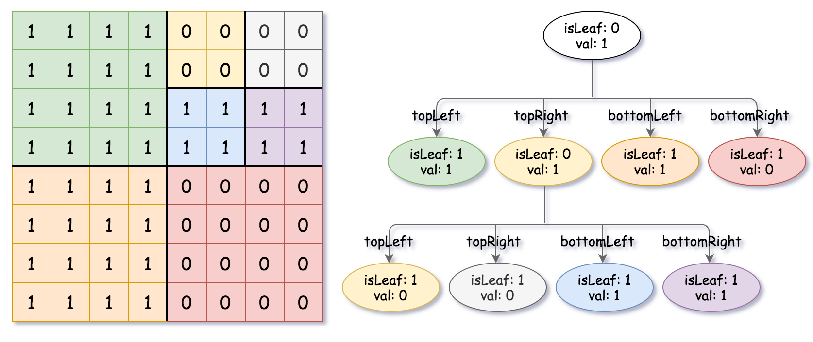

# [LeetCode][leetcode] task # 427: [Construct Quad Tree][task]

Description
-----------

> Given a `n * n` matrix `grid` of `0's` and `1's` only. We want to represent the `grid` with a Quad-Tree.
> 
> Return _the root of the Quad-Tree representing the `grid`_.
> 
> Notice that you can assign the value of a node to **True** or **False** when `isLeaf` is **False**,
> and both are **accepted** in the answer.
> 
> A Quad-Tree is a tree data structure in which each internal node has exactly four children.
> Besides, each node has two attributes:
> * `val`: True if the node represents a grid of 1's or False if the node represents a grid of 0's.
> * `isLeaf`: True if the node is leaf node on the tree or False if the node has the four children.
> ```java
> class Node {
>     public boolean val;
>     public boolean isLeaf;
>     public Node topLeft;
>     public Node topRight;
>     public Node bottomLeft;
>     public Node bottomRight;
> }
> ```
> We can construct a Quad-Tree from a two-dimensional area using the following steps:
> If the current grid has the same value (i.e all `1's` or all `0's`) set `isLeaf` True
> and set `val` to the value of the grid and set the four children to Null and stop.
> 
> If the current grid has different values, set `isLeaf` to False
> and set `val` to any value and divide the current grid into four sub-grids as shown in the photo.
> 
> Recurse for each of the children with the proper sub-grid.


> If you want to know more about the Quad-Tree, you can refer to the [wiki][https://en.wikipedia.org/wiki/Quadtree].
> 
> **Quad-Tree format**:
> 
> The output represents the serialized format of a Quad-Tree using level order traversal,
> where `null` signifies a path terminator where no node exists below.
> 
> It is very similar to the serialization of the binary tree.
> The only difference is that the node is represented as a list `[isLeaf, val]`.
> 
> If the value of `isLeaf` or `val` is True we represent it as **1** in the list `[isLeaf, val]`
> and if the value of `isLeaf` or `val` is False we represent it as **0**.


Example
-------




```sh
Input:
    grid =
    [
        [1,1,1,1,0,0,0,0],
        [1,1,1,1,0,0,0,0],
        [1,1,1,1,1,1,1,1],
        [1,1,1,1,1,1,1,1],
        [1,1,1,1,0,0,0,0],
        [1,1,1,1,0,0,0,0],
        [1,1,1,1,0,0,0,0],
        [1,1,1,1,0,0,0,0]
    ]
Output:
    [[0,1],[1,1],[0,1],[1,1],[1,0],null,null,null,null,[1,0],[1,0],[1,1],[1,1]]
Explanation:
    All values in the grid are not the same. We divide the grid into four sub-grids.
    The topLeft, bottomLeft and bottomRight each has the same value.
    The topRight have different values so we divide it into 4 sub-grids where each has the same value.
    Explanation is shown in the photo below:
```



Solution
--------

| Task | Solution                        |
|:----:|:--------------------------------|
| 427  | [Construct Quad Tree][solution] |


[leetcode]: <http://leetcode.com/>
[task]: <https://leetcode.com/problems/construct-quad-tree/>
[solution]: <https://github.com/wellaxis/praxis-leetcode/blob/main/src/main/java/com/witalis/praxis/leetcode/task/h5/p427/option/Practice.java>
