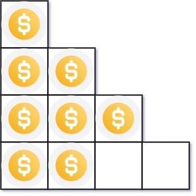

# [LeetCode][leetcode] task # 441: [Arranging Coins][task]

Description
-----------

> You have `n` coins, and you want to build a staircase with these coins.
> The staircase consists of `k` rows where the `i^th` row has exactly `i` coins.
> The last row of the staircase **may be** incomplete.
> 
> Given the integer `n`, return _the number of **complete rows** of the staircase you will build_.

 Example
-------



```sh
Input: n = 8
Output: 3
Explanation: Because the 4^th row is incomplete, we return 3.
```

Solution
--------

| Task | Solution                    |
|:----:|:----------------------------|
| 441  | [Arranging Coins][solution] |


[leetcode]: <http://leetcode.com/>
[task]: <https://leetcode.com/problems/arranging-coins/>
[solution]: <https://github.com/wellaxis/praxis-leetcode/blob/main/src/main/java/com/witalis/praxis/leetcode/task/h5/p441/option/Practice.java>
