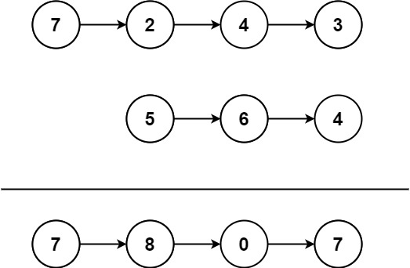

# [LeetCode][leetcode] task # 445: [Add Two Numbers II][task]

Description
-----------

> You are given two **non-empty** linked lists representing two non-negative integers.
> The most significant digit comes first and each of their nodes contains a single digit.
> Add the two numbers and return _the sum as a linked list_.
> 
> You may assume the two numbers do not contain any leading zero, except the number 0 itself.



Example
-------

```sh
Input: l1 = [7,2,4,3], l2 = [5,6,4]
Output: [7,8,0,7]
```

Solution
--------

| Task | Solution                       |
|:----:|:-------------------------------|
| 445  | [Add Two Numbers II][solution] |


[leetcode]: <http://leetcode.com/>
[task]: <https://leetcode.com/problems/add-two-numbers-ii/>
[solution]: <https://github.com/wellaxis/praxis-leetcode/blob/main/src/main/java/com/witalis/praxis/leetcode/task/h5/p445/option/Practice.java>
