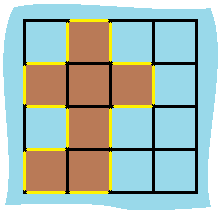

# [LeetCode][leetcode] task # 463: [Island Perimeter][task]

Description
-----------

> You are given `row x col` `grid` representing a map
> where `grid[i][j] = 1` represents land and `grid[i][j] = 0` represents water.
> 
> Grid cells are connected **horizontally/vertically** (not diagonally).
> The `grid` is completely surrounded by water, and there is exactly one island
> (i.e., one or more connected land cells).
> 
> The island doesn't have "lakes", meaning the water inside isn't connected to the water around the island.
> One cell is a square with side length 1.
> The grid is rectangular, width and height don't exceed 100. Determine the perimeter of the island.

 Example
-------



```sh
Input: grid = [[0,1,0,0],[1,1,1,0],[0,1,0,0],[1,1,0,0]]
Output: 16
Explanation: The perimeter is the 16 yellow stripes in the image above.
```

Solution
--------

| Task | Solution                     |
|:----:|:-----------------------------|
| 463  | [Island Perimeter][solution] |


[leetcode]: <http://leetcode.com/>
[task]: <https://leetcode.com/problems/island-perimeter/>
[solution]: <https://github.com/wellaxis/witalis-jkit/blob/main/module/tasks/src/main/java/com/witalis/jkit/tasks/core/task/leetcode/h5/p463/option/Practice.java>
