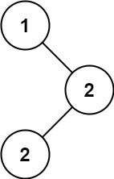

# [LeetCode][leetcode] task # 501: [Find Mode in Binary Search Tree][task]

Description
-----------

> Given the `root` of a binary search tree (BST) with duplicates,
> return _all the `mode(s)` (i.e., the most frequently occurred element) in it_.
> 
> If the tree has more than one mode, return them in **any order**.
> 
> Assume a BST is defined as follows:
> * The left subtree of a node contains only nodes with keys **less than or equal to** the node's key.
> * The right subtree of a node contains only nodes with keys **greater than or equal to** the node's key.
> * Both the left and right subtrees must also be binary search trees.

 Example
-------



```sh
Input: root = [1,null,2,2]
Output: [2]
```

Solution
--------

| Task | Solution                                    |
|:----:|:--------------------------------------------|
| 501  | [Find Mode in Binary Search Tree][solution] |


[leetcode]: <http://leetcode.com/>
[task]: <https://leetcode.com/problems/find-mode-in-binary-search-tree/>
[solution]: <https://github.com/wellaxis/witalis-jkit/blob/main/module/tasks/src/main/java/com/witalis/jkit/tasks/core/task/leetcode/h6/p501/option/Practice.java>
