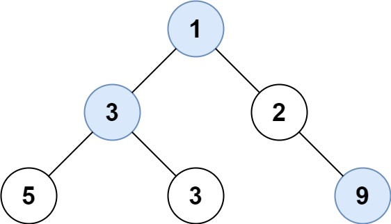

# [LeetCode][leetcode] task # 515: [Find Largest Value in Each Tree Row][task]

Description
-----------

> Given the `root` of a binary tree, return _an array of the largest value in each row of the tree **(0-indexed)**_.

 Example
-------



```sh
Input: root = [1,3,2,5,3,null,9]
Output: [1,3,9]
```

Solution
--------

| Task | Solution                                        |
|:----:|:------------------------------------------------|
| 515  | [Find Largest Value in Each Tree Row][solution] |


[leetcode]: <http://leetcode.com/>
[task]: <https://leetcode.com/problems/find-largest-value-in-each-tree-row/>
[solution]: <https://github.com/wellaxis/praxis-leetcode/blob/main/src/main/java/com/witalis/praxis/leetcode/task/h6/p515/option/Practice.java>
