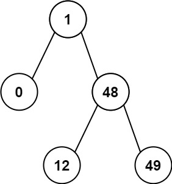

# [LeetCode][leetcode] task # 530: [Minimum Absolute Difference in BST][task]

Description
-----------

> Given the `root` of a Binary Search Tree (BST),
> return _the minimum absolute difference between the values of any two different nodes in the tree_.

 Example
-------



```sh
Input: root = [1,0,48,null,null,12,49]
Output: 1
```

Solution
--------

| Task | Solution                                       |
|:----:|:-----------------------------------------------|
| 530  | [Minimum Absolute Difference in BST][solution] |


[leetcode]: <http://leetcode.com/>
[task]: <https://leetcode.com/problems/minimum-absolute-difference-in-bst/>
[solution]: <https://github.com/wellaxis/praxis-leetcode/blob/main/src/main/java/com/witalis/praxis/leetcode/task/h6/p530/option/Practice.java>
