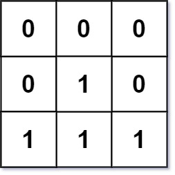

# [LeetCode][leetcode] task # 542: [01 Matrix][task]

Description
-----------

> Given an `m x n` binary matrix `mat`, return _the distance of the nearest `0` for each cell_.
> 
> The distance between two adjacent cells is `1`.

Example
-------



```sh
Input: mat = [[0,0,0],[0,1,0],[1,1,1]]
Output: [[0,0,0],[0,1,0],[1,2,1]]
```

Solution
--------

| Task | Solution              |
|:----:|:----------------------|
| 542  | [01 Matrix][solution] |


[leetcode]: <http://leetcode.com/>
[task]: <https://leetcode.com/problems/01-matrix/>
[solution]: <https://github.com/wellaxis/praxis-leetcode/blob/main/src/main/java/com/witalis/praxis/leetcode/task/h6/p542/option/Practice.java>
