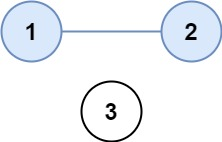

# [LeetCode][leetcode] task # 547: [Number of Provinces][task]

Description
-----------

> There are `n` cities. Some of them are connected, while some are not.
> If city `a` is connected directly with city `b`, and city `b` is connected directly with city `c`,
> then city `a` is connected indirectly with city `c`.
> 
> A **province** is a group of directly or indirectly connected cities and no other cities outside the group.
> 
> You are given an `n x n` matrix `isConnected` where `isConnected[i][j] = 1`
> if the `i^th` city and the `j^th` city are directly connected, and `isConnected[i][j] = 0` otherwise.
> 
> Return _the total number of **provinces**_.

 Example
-------



```sh
Input: isConnected = [[1,1,0],[1,1,0],[0,0,1]]
Output: 2
```

Solution
--------

| Task | Solution                        |
|:----:|:--------------------------------|
| 547  | [Number of Provinces][solution] |


[leetcode]: <http://leetcode.com/>
[task]: <https://leetcode.com/problems/number-of-provinces/>
[solution]: <https://github.com/wellaxis/praxis-leetcode/blob/main/src/main/java/com/witalis/praxis/leetcode/task/h6/p547/option/Practice.java>
