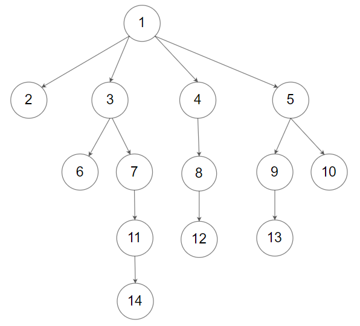

# [LeetCode][leetcode] task # 559: [Maximum Depth of N-ary Tree][task]

Description
-----------

> Given a `n`-ary tree, find _its maximum depth_.
> 
> The **maximum depth** is the number of nodes along the longest path
> from the root node down to the farthest leaf node.
> 
> `N`ary-Tree input serialization is represented in their level order traversal,
> each group of children is separated by the null value (See examples).

 Example
-------



```sh
Input: root = [1,null,2,3,4,5,null,null,6,7,null,8,null,9,10,null,null,11,null,12,null,13,null,null,14]
Output: 5
```

Solution
--------

| Task | Solution                                |
|:----:|:----------------------------------------|
| 559  | [Maximum Depth of N-ary Tree][solution] |


[leetcode]: <http://leetcode.com/>
[task]: <https://leetcode.com/problems/maximum-depth-of-n-ary-tree/>
[solution]: <https://github.com/wellaxis/witalis-jkit/blob/main/module/tasks/src/main/java/com/witalis/jkit/tasks/core/task/leetcode/h6/p559/option/Practice.java>
