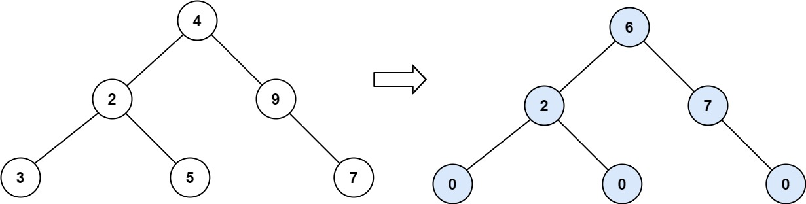

# [LeetCode][leetcode] task # 563: [Binary Tree Tilt][task]

Description
-----------

> Given the `root` of a binary tree, return _the sum of every tree node's **tilt**_.
> 
> The **tilt** of a tree node is the **absolute difference** between the sum
> of all left subtree node **values** and all right subtree node **values**.
> If a node does not have a left child, then the sum of the left subtree node **values** is treated as `0`.
> The rule is similar if the node does not have a right child.

 Example
-------



```sh
Input: root = [4,2,9,3,5,null,7]
Output: 15
Explanation: 
Tilt of node 3 : |0-0| = 0 (no children)
Tilt of node 5 : |0-0| = 0 (no children)
Tilt of node 7 : |0-0| = 0 (no children)
Tilt of node 2 : |3-5| = 2 (left subtree is just left child, so sum is 3; right subtree is just right child, so sum is 5)
Tilt of node 9 : |0-7| = 7 (no left child, so sum is 0; right subtree is just right child, so sum is 7)
Tilt of node 4 : |(3+5+2)-(9+7)| = |10-16| = 6 (left subtree values are 3, 5, and 2, which sums to 10; right subtree values are 9 and 7, which sums to 16)
Sum of every tilt : 0 + 0 + 0 + 2 + 7 + 6 = 15
```

Solution
--------

| Task | Solution                     |
|:----:|:-----------------------------|
| 563  | [Binary Tree Tilt][solution] |


[leetcode]: <http://leetcode.com/>
[task]: <https://leetcode.com/problems/diameter-of-binary-tree/>
[solution]: <https://github.com/wellaxis/praxis-leetcode/blob/main/src/main/java/com/witalis/praxis/leetcode/task/h6/p563/option/Practice.java>
