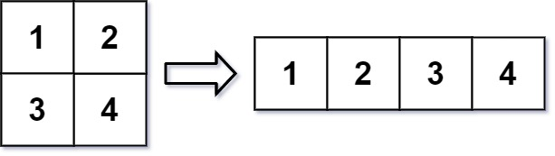

# [LeetCode][leetcode] task # 566: [Reshape the Matrix][task]

Description
-----------

> In MATLAB, there is a handy function called `reshape` which can reshape an `m x n` matrix
> into a new one with a different size `r x c` keeping its original data.
> 
> You are given an `m x n` matrix `mat` and two integers `r` and `c`
> representing the number of rows and the number of columns of the wanted re-shaped matrix.
> 
> The reshaped matrix should be filled with all the elements of the original matrix
> in the same row-traversing order as they were.
> 
> If the `reshape` operation with given parameters is possible and legal,
> output the new reshaped matrix; Otherwise, output the original matrix.

 Example
-------



```sh
Input: mat = [[1,2],[3,4]], r = 1, c = 4
Output: [[1,2,3,4]]
```

Solution
--------

| Task | Solution                       |
|:----:|:-------------------------------|
| 566  | [Reshape the Matrix][solution] |


[leetcode]: <http://leetcode.com/>
[task]: <https://leetcode.com/problems/reshape-the-matrix/>
[solution]: <https://github.com/wellaxis/witalis-jkit/blob/main/module/tasks/src/main/java/com/witalis/jkit/tasks/core/task/leetcode/h6/p566/option/Practice.java>
