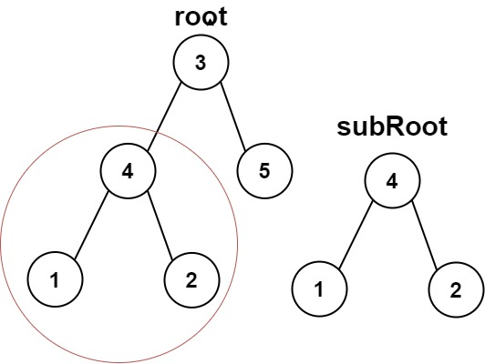

# [LeetCode][leetcode] task # 572: [Subtree of Another Tree][task]

Description
-----------

> Given the roots of two binary trees `root` and `subRoot`, return `true` if there is a subtree of `root`
> with the same structure and node values of `subRoot` and `false` otherwise.
> 
> A subtree of a binary tree `tree` is a tree that consists of a node in `tree`
> and all of this node's descendants. The tree `tree` could also be considered as a subtree of itself.

 Example
-------



```sh
Input: root = [3,4,5,1,2], subRoot = [4,1,2]
Output: true
```

Solution
--------

| Task | Solution                            |
|:----:|:------------------------------------|
| 572  | [Subtree of Another Tree][solution] |


[leetcode]: <http://leetcode.com/>
[task]: <https://leetcode.com/problems/subtree-of-another-tree/>
[solution]: <https://github.com/wellaxis/praxis-leetcode/blob/main/src/main/java/com/witalis/praxis/leetcode/task/h6/p572/option/Practice.java>
